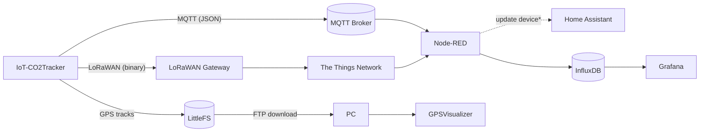

<div style="display: flex; justify-content: flex-start; margin-bottom: 20px;">

[](https://github.com/paclema/iot-co2Tracker/releases/latest)

</div>


<!--  -->
The IoT-CO2Tracker is a compact device that measures CO₂, temperature, and humidity. Initially developed on an ESP8266, it was later moved to an ESP32 using the [IoT-PostBox](../iot-postbox/) board. The project also serves to validate the board's capabilities, though that is not its primary purpose.

An external GPS module can be connected via the serial port, allowing the device to publish both sensor readings and location data. This data is sent via LoRaWAN to The Things Network (TTN) for coverage and connectivity analysis, and over Wi‑Fi using MQTT to your own broker. When needed, GPS tracks are logged to the onboard flash storage and can be downloaded for visualization through a built‑in FTP server. The latest hardware revision includes a 2" TFT screen that displays live sensor values, connectivity, and battery status, with a user interface built on LVGL v9 and designed with SquareLine.

<p align="center" width="100%">
  <a href="/projects/iot-co2tracker/_DSC5898.JPG">
    
  </a>
</p>


## Communication flow



<sub>* planned (to be implemented)</sub>

### MQTT
- Topic: `/iot-co2Tracker/<deviceId>/data`

Example payload (without GPS):

```json
{
  "CO2": 222,
  "temp": 33.02967834,
  "humidity": 30.82733154,
  "rssi_STA": -38,
  "vBat": 4.21023798,
  "vBus": 5.021749973,
  "PowerStatus": 2,
  "ChargingStatus": 2
}
```

Example payload (with GPS):

```json
{
  "CO2": 229,
  "temp": 31.5396347,
  "humidity": 29.40368652,
  "lat": 51.27265917,
  "lng": 12.37718133,
  "date": 120925,
  "time": 15070704,
  "speed": 0.11112,
  "satellites": 4,
  "altitude": 197.6,
  "hdop": 8.33,
  "course": 120925,
  "rssi_STA": -54,
  "vBat": 4.116175175,
  "vBus": 0.01325,
  "PowerStatus": 3,
  "ChargingStatus": 1
}
```

### LoRaWAN uplink

| Field            | C type     | Bytes | Units     | Notes |
|------------------|------------|-------|-----------|-------|
| latitude         | uint32_t   | 4     | degrees   | 24‑bit value scaled to 4 bytes ((lat+90)/180*16777215) |
| longitude        | uint32_t   | 4     | degrees   | 24‑bit value scaled to 4 bytes ((lng+180)/360*16777215) |
| altitude         | uint16_t   | 2     | m         |  |
| hdop             | uint16_t   | 2     | HDOP      |  |
| speed            | uint16_t   | 2     | km/h      | value = km/h × 100 |
| satellites       | uint8_t    | 1     | count     |  |
| course           | uint16_t   | 2     | degrees   |  |
| time             | uint32_t   | 4     | HHMMSScc  | local offset applied |
| vBat             | uint16_t   | 2     | mV        |  |
| vBus             | uint16_t   | 2     | mV        |  |
| CO2              | uint16_t   | 2     | ppm       |  |
| temp             | uint16_t   | 2     | °C        | value = °C × 100 |
| hum              | uint16_t   | 2     | %         | value = % × 100 |
| powerStatus      | uint8_t    | 1     | enum      |  |
| chargingStatus   | uint8_t    | 1     | enum      |  |

Notes
- Multi‑byte fields are big‑endian (MSB first).
- Latitude/Longitude use 24‑bit effective values packed into 4 bytes (high byte may be 0).
- Total payload length: 33 bytes.

Decoders: see [formaters/](https://github.com/paclema/iot-co2Tracker/tree/HEAD/formaters) for TTN uplink decoders and field mapping.

TTN setup (OTAA)
1. Create an application `co2Tracker` and register a device.
2. Set the device DEVEUI, APPEUI, and APPKEY to your `config.json`.
3. Add the custom uplink decoder from [formaters/custom](https://github.com/paclema/iot-co2Tracker/tree/HEAD/formaters/custom) to your TTN application.
4. Join the device and verify uplinks in the TTN console under the [Application live data tab](https://eu1.cloud.thethings.network/console/applications/co2tracker/data).

### FTP GPS logs
- If the `local_logs` configuration is enabled in the [config.json](https://github.com/paclema/iot-co2Tracker/blob/HEAD/data/config/config.json) file, GPS log files will be created on the LittleFS partition. The file names will follow a specific naming convention, such as [`GPS_2025_9_10.csv`](https://github.com/paclema/iot-co2Tracker/blob/HEAD/docs/GPS_2025_9_10.csv).
- Connect via FTP to the device server using the username and password configured in [config.json](https://github.com/paclema/iot-co2Tracker/blob/HEAD/data/config/config.json) to download the GPS log file.
- CSV columns follow:

```csv
time,latitude,longitude,altitude,speed,hdop,satellites,course,vBat,vBus,PowerStatus,ChargingStatus,co2,temp,hum
18182040,51.27235567,12.37730017,115.1,31.503,1.06,12,162.6,3.98449,0.00795,1,2,239,22.34,57.10
18182553,51.27197583,12.37750567,115.6,31.540,1.06,12,162.8,3.98449,0.00795,1,2,232,22.34,57.15
18183040,51.27155317,12.37771250,116.4,29.595,1.06,12,167.4,3.98073,0.00795,1,2,221,22.36,57.19
18183541,51.27119583,12.37782367,117.2,29.058,1.15,12,167.5,3.98073,0.00795,1,2,207,22.38,57.31
```
- You can visualize the GPS tracks using tools like [GPSVisualizer](http://www.gpsvisualizer.com/) by uploading the CSV file. A good filter in this case can the [IoT-CO2Tracker GPSVisualizer configuration](https://www.gpsvisualizer.com/map_input?bg_map=google_map&country=de&form=google&format=google&trk_as_wpt=colorize&trk_colorize=custom&trk_colorize_custom=speed&units=metric&wpt_colorize=speed) option.


## Software

### Firmware
- PlatformIO project (ESP32). FreeRTOS tasks for sensors, UI, and communications.
- Main Libraries used: 
  - [WebConfigServer](https://github.com/paclema/WebConfigServer): to configure the device settings over a web interface and manage multiple common services
  - [MQTTClient](https://github.com/paclema/MQTTClient): MQTT client library
  - [LoRaWANClient](https://github.com/paclema/LoRaWANClient): LoRaWAN C++ client based on [Arduino-LMIC](https://github.com/mcci-catena/arduino-lmic)
  - [PowerManagement](https://github.com/paclema/PowerManagement): power management library to read battery and power states
  - [SparkFun SCD30](https://github.com/sparkfun/SparkFun_SCD30_Arduino_Library): read CO₂, temperature, and humidity from the SCD30 sensor
  - [TinyGPSPlus](https://github.com/mikalhart/TinyGPSPlus): parse GPS data

### Display & User Interface (UI-LCD)

- Designed for a 2.0" GMT020-02 TFT SPI LCD (ST7789V driver, non-touch).
- Uses LVGL v9.
- Interface designed with SquareLine. The project can be found under [`SquareLineProject/`](https://github.com/paclema/iot-co2Tracker/tree/HEAD/SquareLineProject).

<p align="center">
  
</p>

### Backend services

- **Node-RED** subscribes to MQTT and TTN, processes messages, and stores data values in InfluxDB (requires [node-red-contrib-influxdb](https://flows.nodered.org/node/node-red-contrib-influxdb) node installation).

- Example flow: [backend/nodered/flows.json](https://github.com/paclema/iot-co2Tracker/blob/HEAD/backend/nodered/flows.json)
- **Grafana** dashboards read from InfluxDB.

- Example dashboard: [backend/grafana/IoT-Co2Tracker_dashboard.json](https://github.com/paclema/iot-co2Tracker/blob/HEAD/backend/grafana/IoT-Co2Tracker_dashboard.json)
- **TTN formatters**: see decoders in [formaters/](https://github.com/paclema/iot-co2Tracker/tree/HEAD/formaters) for field mapping.


## Hardware

### Main Components

The essential hardware components for this project include:
- Board: [IoT-PostBox v1](../iot-postbox/v1.x/) (ESP32/ESP32-S2 with onboard RFM95W LoRa module)
- Sensor: SCD30 (CO₂, temperature, humidity) over I²C
- GPS (optional): u-blox M8N or compatible GPS module using serial UART
- Display (optional): 2.0" GMT020-02 TFT OLED SPI LCD with ST7789V driver
- Power: battery support with charging capabilities using IoT-PostBox

### 3D Design & Enclosure

> [!NOTE]
> Explore the 3D model interactively. Use mouse to rotate, zoom and pan. [View Fullscreen 🔍](/projects/iot-co2tracker/viewer.html)

<br>

<iframe src="/projects/iot-co2tracker/viewer.html" 
        width="100%" 
        height="600px" 
        style="border: 1px solid #ddd; border-radius: 8px;">
</iframe>

The enclosure is designed specifically for the [IoT-PostBox v1](../iot-postbox/v1.x/), SCD30 sensor, 2" TFT display, GPS module, and a 1100mAh LiPo battery. It features precise cutouts for connectors, display, and sensor airflow, as well as rear openings for the LoRa antenna, battery switch, and GPS cable. The parametric FreeCAD model allows quick customization for alternative hardware by modifying spreadsheet parameters. Assembly uses four M3x5mm screws.

Resources:

- FreeCAD sources in [3Ddesigns/](https://github.com/paclema/iot-co2Tracker/tree/HEAD/3Ddesigns)
- External STL references documented in [3Ddesigns/lib/readme.md](https://github.com/paclema/iot-co2Tracker/blob/HEAD/3Ddesigns/lib/readme.md).

### Pinout

Pinout highlights (see [boards/](https://github.com/paclema/iot-co2Tracker/tree/HEAD/boards) and [boards/variants/iotpostbox_v1/](https://github.com/paclema/iot-co2Tracker/tree/HEAD/boards/variants/iotpostbox_v1) for full mapping)


## Build & flash
1. Open the project using PlatformIO with VS Code.
2. Configure services and device following the [WebConfigServer](https://github.com/paclema/WebConfigServer) style, editing the [`data/config/config.json`](https://github.com/paclema/iot-co2Tracker/blob/HEAD/data/config/config.json) and uploading the Filesystem Image to the device.
3. Build and upload the firmware to an IoT-PostBox device.
4. Use the device WebConfigServer UI web portal for advanced options.